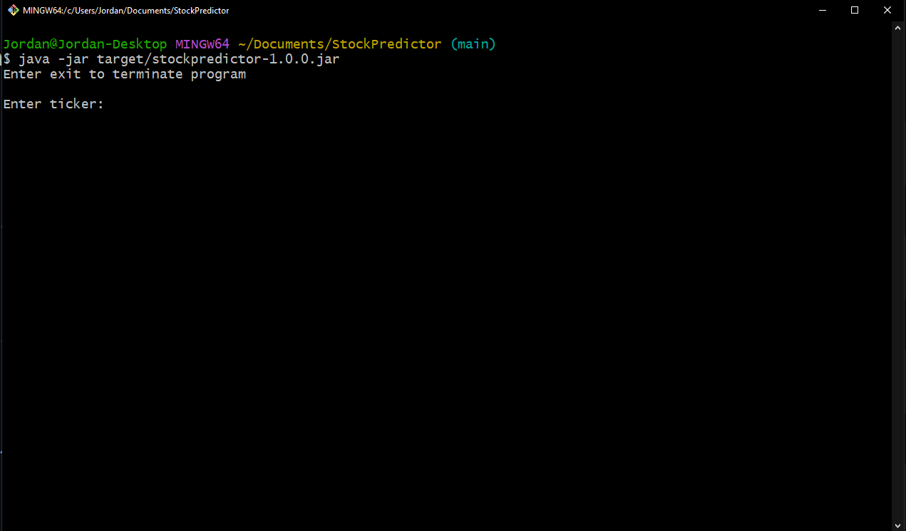

<a name="readme-top"></a>

<br />
<div align="center">
  <a href="https://github.com/JLavigueure/StockPredictor">
    
  </a>

  <h3 align="center">Stock Predictor</h3>

  <p align="center">
    Webscrape stock data and predict markets using linear regression.
    <br />
    <a href="https://github.com/JLavigueure/StockPredictor"><strong>Explore the docs »</strong></a>
    <br />
    <br />
    <a href="https://github.com/JLavigueure/StockPredictor">View Demo</a>
    ·
    <a href="https://github.com/JLavigueure/StockPredictor/issues">Report Bug</a>
    ·
    <a href="https://github.com/JLavigueure/StockPredictor/issues">Request Feature</a>
  </p>
</div>

## About The Project

<div align="center">
  <a href="href="https://github.com/JLavigueure/StockPredictor">
    
  </a>
</div>

Stock Predictor is a webscraper and linear regression model program. It takes a stock ticker, i.e AMZN, MSFT, TSLA, etc. as input, and scrapes all recent market data from YahooFinance for the given stock. Stock Predictor then calculates the linear regression model of closing price for the past 90 days and prints the regression model, r squared, and mean squared error. Finally Stock Predictor prints a buy score between 1 and 10, rating how strongly it recommends buying the stock at this time.

<p align="right">(<a href="#readme-top">back to top</a>)</p>

### Built With

* 
* 
* <a href="https://github.com/jhy/jsoup">Jsoup</a>
* <a href="https://github.com/junit-team">JUnit</a>

### Skills
Webscraping, Object oriented programming(OOP), Data analysis

<p align="right">(<a href="#readme-top">back to top</a>)</p>

<!-- GETTING STARTED -->
## Getting Started

### Prerequisites
* <a href="https://maven.apache.org/download.cgi">Maven</a>

### Installation
1. Clone the repo in your designated folder
   ```sh
   git clone https://github.com/JLavigueure/StockPredictor.git
   ```
2. Move into repo directory
   ```sh
   cd StockPredictor/
   ```
 3. Install Maven packages to target folder
    ```sh
    mvn dependency:copy-dependencies 
    ```
4. Build into jar executable
   ```sh
   mvn package
   ```
5. Run 
   ```sh
   java -jar target/stockpredictor-1.0.0.jar
   ```
<p align="right">(<a href="#readme-top">back to top</a>)</p>

<!-- CONTACT -->
## Contact

* Jordan Lavigueure
* lav.jordan@live.com
* <a href="https://www.linkedin.com/in/jordanlavigueure">
  
  </a>
* <a href="https://github.com/JLavigueure">
  
  </a>


<p align="right">(<a href="#readme-top">back to top</a>)</p>
